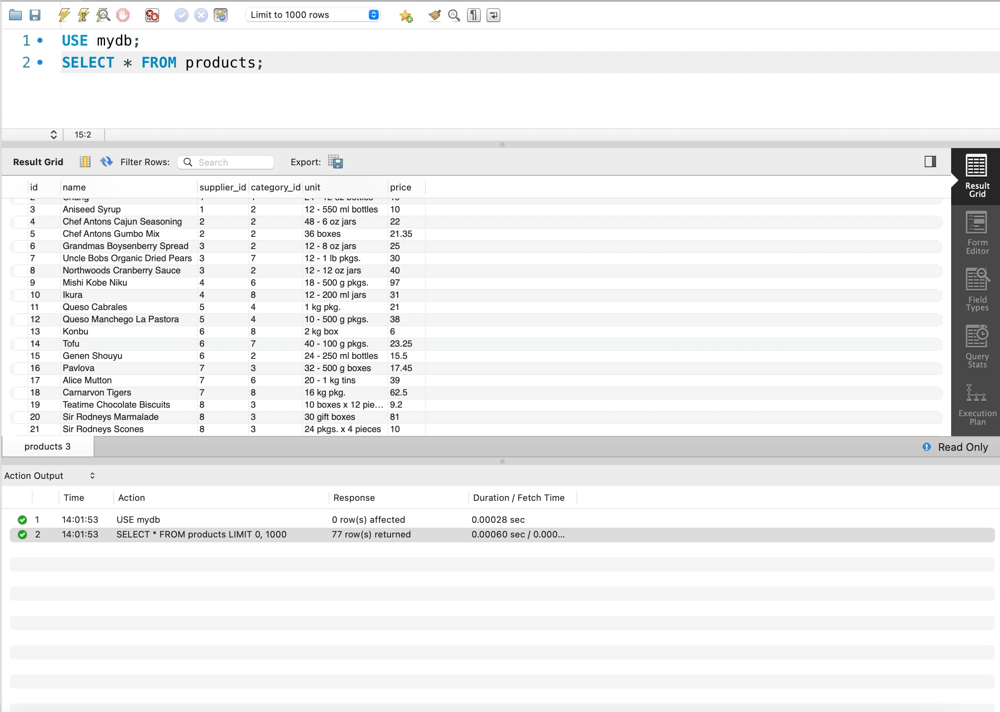
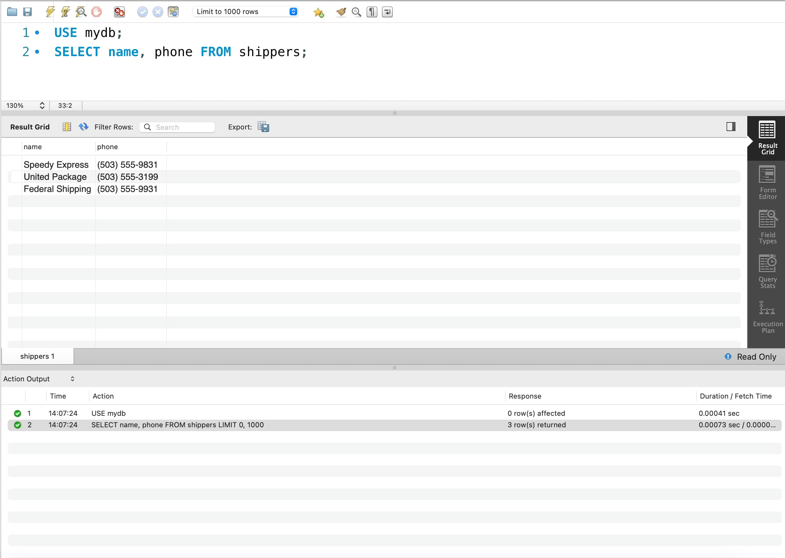
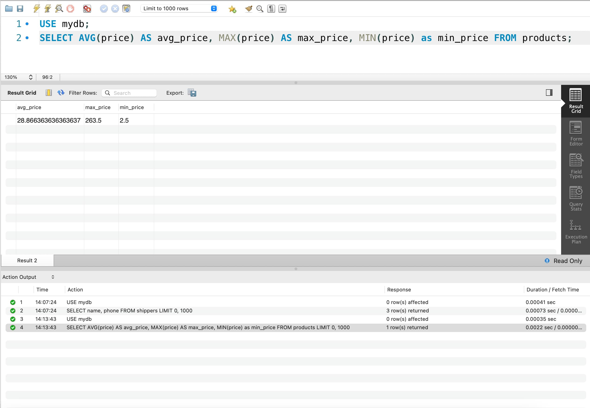
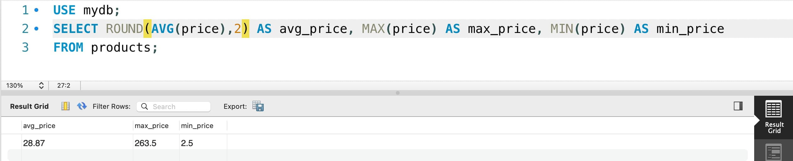
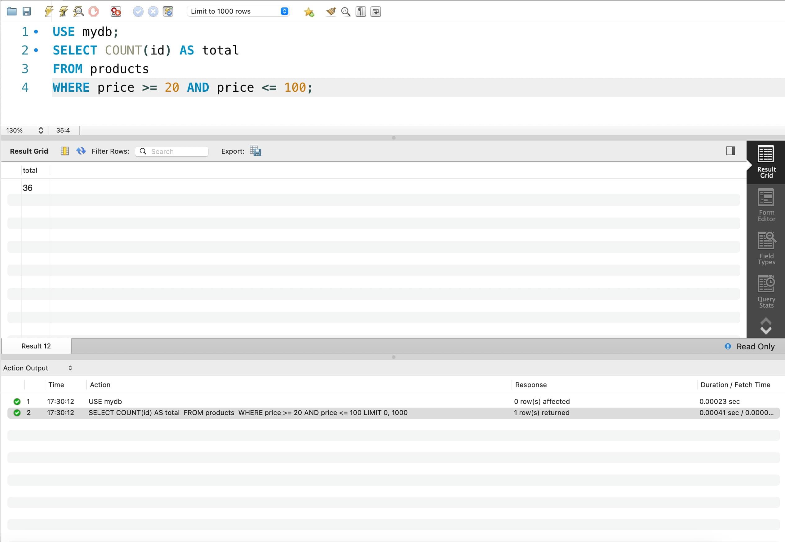
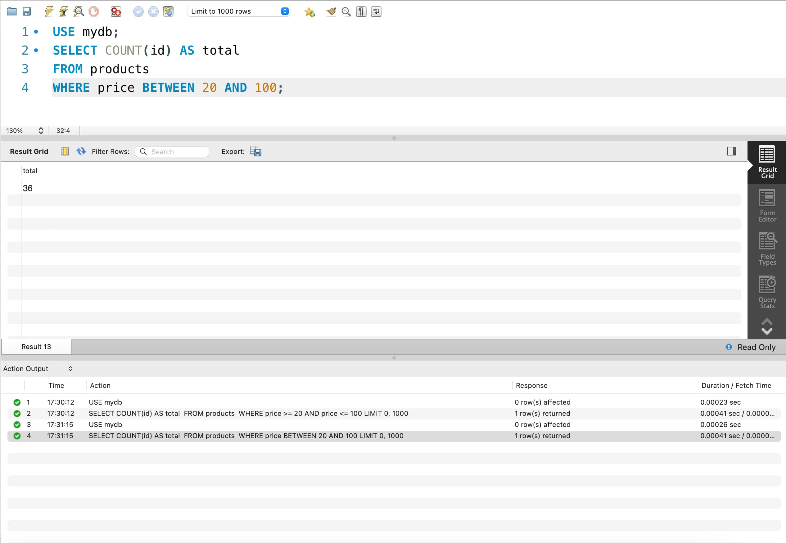

# goit-rdb-hw-03

**#1.1**

```
SELECT * FROM products;
```

<details>
  <summary>Screenshot</summary>



</details>
<br/>

**#1.2**

```
SELECT name, phone FROM shippers;
```

<details>
  <summary>Screenshot</summary>



</details>

---

**#2**

```
SELECT AVG(price) AS avg_price, MAX(price) AS max_price, MIN(price) AS min_price
FROM products;
```

<details>
  <summary>Screenshot</summary>



</details>
<details>
  <summary>ROUND</summary>



</details>

---

**#3**

```
SELECT DISTINCT category_id, price
FROM products
ORDER BY price DESC LIMIT 10;
```

<details>
  <summary>Screenshot</summary>


</details>

---

**#4**

```
SELECT COUNT(id) AS total
FROM products
WHERE price >= 20 AND price <= 100;
```

<details>
  <summary>Screenshot</summary>



</details>
<details>
  <summary>BETWEEN</summary>



</details>

---

**#5**

```
SELECT supplier_id, COUNT(supplier_id) AS total, AVG(price) AS avg_price
FROM products
GROUP BY supplier_id;
```

<details>
  <summary>Screenshot</summary>


</details>
